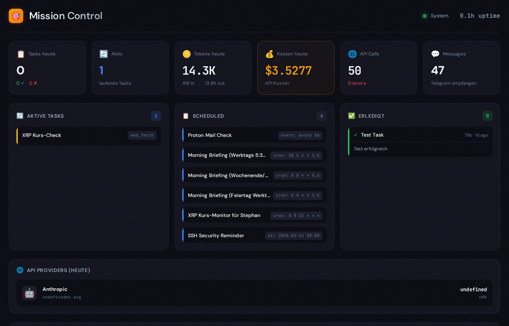
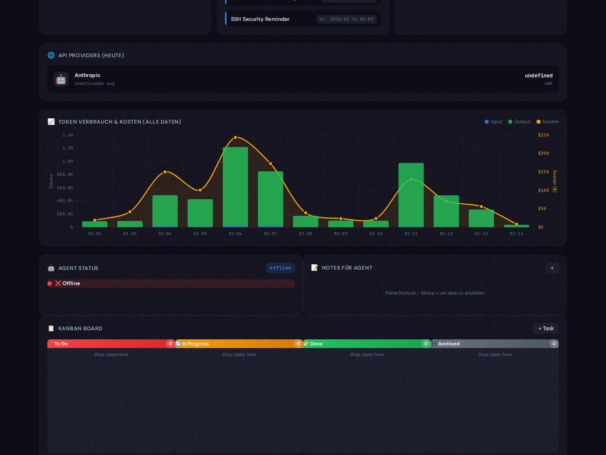

# 🎯 Mission Control Dashboard

**Real-time Activity Dashboard for OpenClaw AI Agents**

A beautiful, modern dashboard that monitors your OpenClaw agent's activity, token usage, costs, and scheduled tasks - all in real-time.



## ✨ Features

### Core Monitoring
- **📊 Token Usage Tracking** - Real data from OpenClaw session files
- **💰 Cost Monitoring** - Daily and weekly cost breakdowns by provider/model
- **💬 Message Counter** - Track actual Telegram messages (filters out system events)
- **⏰ Cron Job Status** - Live view of scheduled jobs from OpenClaw cron
- **📈 Historical Charts** - 7-day token usage visualization with Chart.js
- **🔄 Session Analytics** - Per-session usage statistics
- **🌙 Dark Mode** - Beautiful dark theme

### Task Management (NEW in v3.0)
- **📋 Kanban Board** - Drag & drop task management (To Do → In Progress → Done → Archived)
- **📝 Notes for Agent** - Leave instructions for your agent to check during heartbeats
- **🤖 Live Agent Status** - Real-time online/offline indicator (polls every 10s)
- **📜 Action Log** - Activity history with timestamps (last 100 entries)
- **📁 Quick Deliverables** - Fast access to important folders




## 🚀 Quick Start

### Prerequisites

- Python 3.10+
- OpenClaw running with session logging enabled

### Installation

```bash
# Clone the repository
git clone https://github.com/littlesteve01/mission-control-dashboard.git
cd mission-control-dashboard

# Create virtual environment
python3 -m venv .venv
source .venv/bin/activate

# Install dependencies
pip install -r requirements.txt

# Create data directory
mkdir -p data
```

### Running

```bash
# Start the server
source .venv/bin/activate
uvicorn app.main:app --host 0.0.0.0 --port 8087

# Or use the run script
./run.sh
```

Visit: **http://localhost:8087**

## 📊 Data Sources

The dashboard reads **real data** directly from OpenClaw:

| Source | Path | Description |
|--------|------|-------------|
| Sessions | `~/.openclaw/agents/main/sessions/*.jsonl` | Token usage, costs, messages |
| Cron Jobs | `~/.openclaw/cron/jobs.json` | Scheduled tasks |

No manual logging required - everything is automatically extracted from your OpenClaw session history.

## 🔌 API Endpoints

### Dashboard Stats

| Endpoint | Description |
|----------|-------------|
| `GET /api/stats` | Today's summary (tokens, costs, messages) |
| `GET /api/dashboard` | Complete dashboard data in one call |
| `GET /api/health` | Health check with uptime |

### Token Usage

| Endpoint | Description |
|----------|-------------|
| `GET /api/tokens/summary?days=7` | Daily token/cost breakdown |
| `GET /api/tokens/today` | Today's detailed usage |
| `GET /api/tokens/total` | All-time totals |
| `GET /api/calls/by-provider?days=7` | Usage by provider/model |
| `GET /api/sessions?days=7&limit=20` | Per-session statistics |

### Cron Jobs

| Endpoint | Description |
|----------|-------------|
| `GET /api/cron` | All enabled cron jobs |
| `GET /api/cron/summary` | Summary with next runs |
| `GET /api/cron/next?count=5` | Next scheduled jobs |
| `GET /api/cron/recent?count=10` | Recent job runs |

### Kanban Board

| Endpoint | Description |
|----------|-------------|
| `GET /api/kanban` | Get all tasks grouped by column |
| `POST /api/kanban` | Create new task |
| `PATCH /api/kanban/{id}` | Update task |
| `DELETE /api/kanban/{id}` | Delete task |
| `POST /api/kanban/{id}/move` | Move task to different column |

### Notes

| Endpoint | Description |
|----------|-------------|
| `GET /api/notes` | Get all notes |
| `POST /api/notes` | Create note |
| `PATCH /api/notes/{id}/read` | Mark as read |
| `DELETE /api/notes/{id}` | Delete note |

### Agent Status

| Endpoint | Description |
|----------|-------------|
| `GET /api/agent/status` | Get real-time agent status |

### Action Log

| Endpoint | Description |
|----------|-------------|
| `GET /api/logs` | Get action log entries |
| `DELETE /api/logs/clear` | Clear old logs |

### Deliverables

| Endpoint | Description |
|----------|-------------|
| `GET /api/deliverables` | Get quick access items |
| `POST /api/deliverables` | Add deliverable |

### Cache

| Endpoint | Description |
|----------|-------------|
| `POST /api/cache/clear` | Force re-read of session files |

## 🏗️ Architecture

```
mission-control/
├── app/
│   ├── main.py              # FastAPI application
│   ├── database.py          # SQLite connection
│   ├── models.py            # SQLAlchemy models
│   ├── schemas.py           # Pydantic schemas
│   └── services/
│       ├── session_parser.py   # JSONL session file parser
│       ├── aggregator.py       # Stats aggregation
│       └── cron_reader.py      # Cron job reader
├── templates/
│   └── index.html           # Dashboard UI
├── static/
│   └── style.css            # Styles
├── data/                    # SQLite database (gitignored)
├── screenshots/             # Documentation images
├── requirements.txt
├── run.sh
└── README.md
```

### How It Works

1. **Session Parser** parses OpenClaw's JSONL session files
   - Extracts `usage` objects (tokens, costs) from messages
   - Filters system messages vs real user messages
   - Caches results (re-parses only on file change)

2. **Aggregator** computes statistics
   - Daily aggregations with history
   - Provider/model breakdowns
   - 30-second result caching

3. **Cron Reader** reads OpenClaw's cron configuration
   - Job schedules (cron expressions, intervals)
   - Last/next run times and status

## ⚡ Performance

- **File Caching**: Session files cached, only re-parsed when modified
- **Result Caching**: Stats cached for 30 seconds
- **Lazy Loading**: Services initialized on first request
- **Incremental**: Only reads files from requested time range

## 🛠️ Tech Stack

- **[FastAPI](https://fastapi.tiangolo.com/)** - Modern Python web framework
- **[SQLAlchemy](https://www.sqlalchemy.org/)** - ORM for local task tracking
- **[SQLite](https://sqlite.org/)** - Lightweight local database
- **[Jinja2](https://jinja.palletsprojects.com/)** - HTML templates
- **[Chart.js](https://www.chartjs.org/)** - Beautiful charts
- **Vanilla JS** - No frontend framework needed

## 🎨 Customization

### Changing the Session Path

Edit `app/services/session_parser.py`:

```python
class SessionParser:
    SESSIONS_DIR = os.path.expanduser("~/.openclaw/agents/main/sessions")
```

### Adding New Stats

1. Add extraction logic in `session_parser.py`
2. Add aggregation in `aggregator.py`
3. Add endpoint in `main.py`
4. Update the dashboard template

## 📝 License

MIT License - feel free to use this for your own OpenClaw setup!

## 🤝 Contributing

Contributions welcome! Please feel free to submit a Pull Request.

---

**Made with 🐾 for the OpenClaw community**
